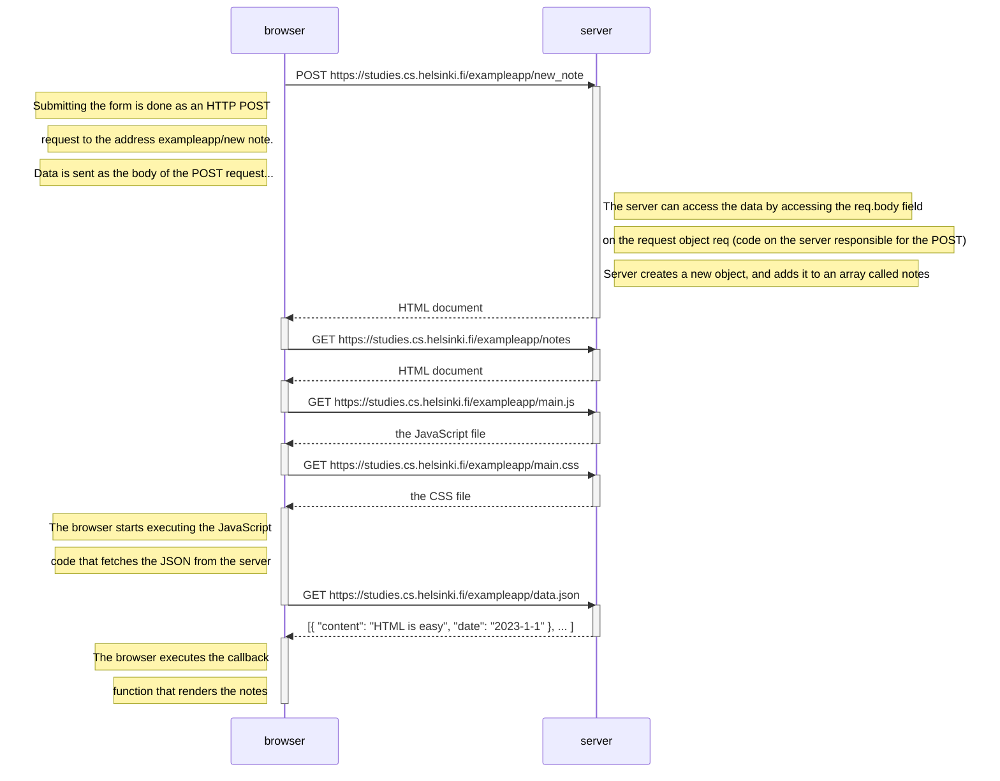

```mermaid
  sequenceDiagram
  participant browser
  participant server

  browser->>server: POST https://studies.cs.helsinki.fi/exampleapp/new_note
  activate server
  note left of browser: Submitting the form is done as an HTTP POST 
  note left of browser: request to the address exampleapp/new note.
  note left of browser: Data is sent as the body of the POST request...
  note right of server: The server can access the data by accessing the req.body field 
  note right of server: on the request object req (code on the server responsible for the POST)
  note right of server: Server creates a new object, and adds it to an array called notes
  server-->>browser: HTML document
  deactivate server

  activate browser
  browser->>server: GET https://studies.cs.helsinki.fi/exampleapp/notes
  deactivate browser

  activate server
  server-->>browser: HTML document
  deactivate server

  activate browser
  browser->>server: GET https://studies.cs.helsinki.fi/exampleapp/main.js
  deactivate browser

  activate server
  server-->>browser: the JavaScript file
  deactivate server

  activate browser
  browser->>server: GET https://studies.cs.helsinki.fi/exampleapp/main.css
  deactivate browser

  activate server
  server-->>browser: the CSS file
  deactivate server

  activate browser
  Note left of browser: The browser starts executing the JavaScript 
  Note left of browser: code that fetches the JSON from the server
  browser->>server: GET https://studies.cs.helsinki.fi/exampleapp/data.json
  deactivate browser

  activate server
  server-->>browser: [{ "content": "HTML is easy", "date": "2023-1-1" }, ... ]
  deactivate server

  activate browser
  Note left of browser: The browser executes the callback
  Note left of browser: function that renders the notes
  deactivate browser 
```