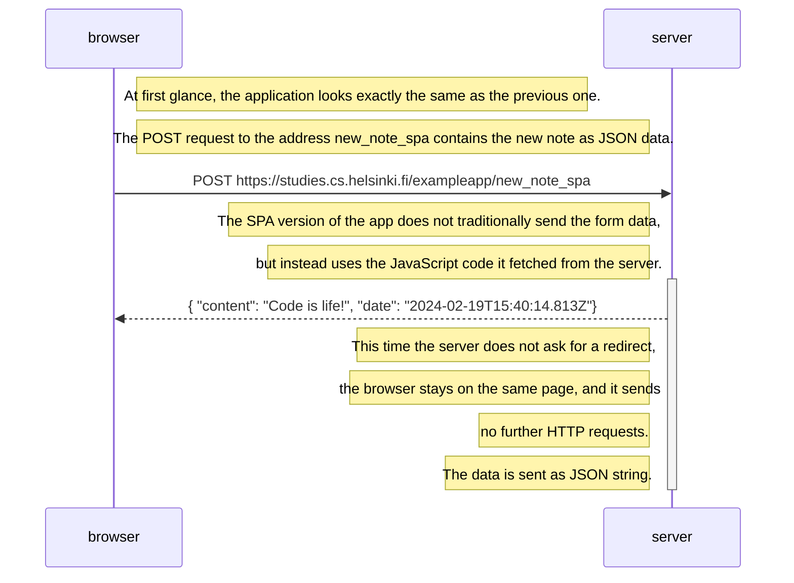

```mermaid
  sequenceDiagram
      participant browser
      participant server

      note right of browser: At first glance, the application looks exactly the same as the previous one.
      note right of browser: The POST request to the address new_note_spa contains the new note as JSON data.
      browser->>server: POST https://studies.cs.helsinki.fi/exampleapp/new_note_spa
      note left of server: The SPA version of the app does not traditionally send the form data,
      note left of server: but instead uses the JavaScript code it fetched from the server.
      activate server
      server-->>browser: {  "content": "Code is life!",   "date": "2024-02-19T15:40:14.813Z"}
      note left of server: This time the server does not ask for a redirect,
      note left of server: the browser stays on the same page, and it sends
      note left of server: no further HTTP requests.
      note left of server: The data is sent as JSON string.
      deactivate server
```